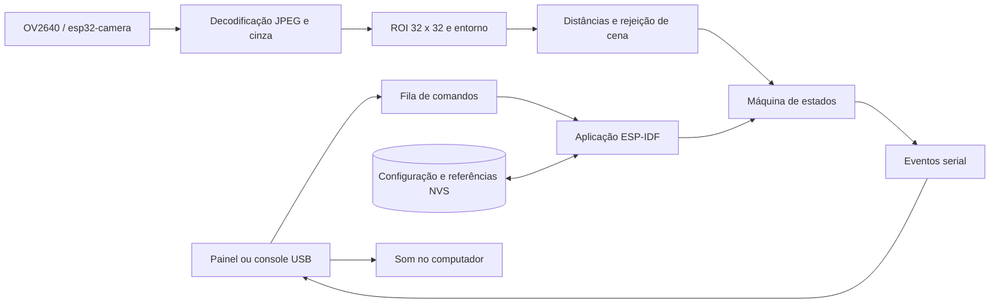

# Arquitetura e rastreabilidade

## Base documental e decisões

`Tarefa 02 - Turma 3.docx` é o texto consolidado e detalha os requisitos RF01–RF12/RNF01–RNF11. `Projeto_Auditor_Visual_Medicacao.docx` e a apresentação descrevem o protótipo inicial. `Documento de Proposta PCS-USP_.docx` descreve uma alternativa anterior com CNN, RTC, deep sleep e outra placa; essa arquitetura não é exigida pelo escopo mínimo consolidado e não cabe na lista atual de materiais. Os PDFs ESP32 são referências gerais do chip e de Bluetooth, não esquemas da câmera da placa comercial. Bluetooth não é usado.

A implementação troca o ESP32-S3 pelo ESP32 clássico escolhido pelo grupo e o buzzer/botão pelo painel USB. Mantém classificação e decisão embarcadas; o computador configura, registra e produz som. Nenhum modelo de IA pré-treinado foi apresentado como classificador de medicamentos.

## Fluxo

O núcleo em `components/auditor` não depende de FreeRTOS, câmera ou relógio de parede. `main/camera.cpp` é o único proprietário do driver. `main/storage.cpp` preserva um único blob de configuração/referências. `main/app_main.cpp` serializa comandos, aquisição e transições; uma segunda tarefa recebe bytes UART. As gravações NVS ocorrem só ao configurar/calibrar, nunca em cada quadro.

## Visão

A captura usa JPEG QQVGA e um único framebuffer DRAM para não pressupor PSRAM. O primeiro buffer é descartado a cada captura para evitar reutilização de uma imagem anterior. Antes de decodificar, confere-se o tamanho do JPEG, limitando a saída ao buffer RGB. A imagem é convertida em cinza com pesos inteiros. O recorte é reduzido por médias de blocos a 1024 intensidades; uma grade de até 192 pontos acompanha o entorno, excluindo os pontos dentro da ROI e normalizando pela quantidade efetivamente usada.

A comparação utiliza a média da diferença absoluta de intensidade, sem depender de treinamento. Uma classe só é aceita se:

1. As duas referências estão válidas e suficientemente separadas.
2. A imagem não é predominantemente escura ou saturada.
3. O entorno permanece próximo de uma referência.
4. A diferença entre as distâncias às duas classes supera a margem.
5. A distância à referência escolhida está abaixo do menor valor entre o limiar configurado e 45% da distância entre referências.

Cada observação adquire dois quadros e exige estabilidade espacial entre eles. A calibração agrega cinco quadros comparados ao primeiro. A persistência de vazio é avaliada novamente entre observações da agenda. Esses mecanismos reduzem a influência de mãos e movimento, mas não garantem rejeição universal: uma oclusão visualmente semelhante ao vazio pode confundir o método. O teste óptico independente é obrigatório antes de atribuir desempenho.

## Agenda e resultados

O armamento captura presença atual e converte a próxima ocorrência do horário civil em um prazo monotônico. O ciclo é único. O próximo intervalo conta da conclusão da leitura, sem rajadas de recuperação após lentidão. Capturas concluídas depois do limite não podem confirmar retirada. Um intervalo entre observações maior que o configurado mais 2 s quebra a sequência de confirmação.

No fim da janela, somente uma observação recente `present` permite `alert`; qualquer ausência de evidência ou um vazio ainda não confirmado resulta em `fault`. “Recente” significa até intervalo + 2 s, contados até a verificação do prazo. A tarefa principal tenta observar enquanto ainda dentro da janela; uma chamada bloqueante ao driver pode atrasar a emissão final. `duration_ms` mede o custo completo para conferir RNF02.

`ack` mantém `alert`/`fault` e marca reconhecimento. `cancel` aborta explicitamente. O resultado não rearma a próxima dose; somente `arm` com nova presença o faz. Após reset, a configuração continua salva, mas a hora e o ciclo precisam de confirmação humana.

## Requisitos

| Requisito | Implementação / limite |
|---|---|
| RF01 | `set`, agenda, `time`; console/painel USB |
| RF02 | ROI e cinco amostras por referência em NVS |
| RF03 | Agenda monotônica e captura automática durante a janela |
| RF04 | `classify`: presente, vazio, inconclusivo; vazio isolado não é resultado de retirada |
| RF05 | Presença no armamento, persistência temporal e rejeição de cena |
| RF06 | **Adaptado:** alerta serial e som no computador; sem buzzer autônomo |
| RF07 | **Adaptado:** botão virtual/`ack`; serial para estados, sem LED não confirmado |
| RF08 | Eventos JSONL, timestamps, duração, configurações e logs no computador |
| RF09 | Falha de captura gera inconclusivo; falta de hora impede armar |
| RF10 | NVS; reset exige hora válida e rearmamento |
| RF11 | `arm` exige nova observação presente; sem repetição automática |
| RF12 | Opcional, não implementado; Wi-Fi desligado nesta entrega |
| RNF01 | **Adaptado:** classificação no ESP32 clássico; som no computador |
| RNF02 | Instrumentação implementada; tempo precisa ser medido na placa |
| RNF03 | Avaliador de logs + ensaio de bancada; metas não presumidas |
| RNF04 | Registro de condições de ensaio no protocolo de validação |
| RNF05 | Sem dependência de rede; captura/decisão independem do painel |
| RNF06 | Heap nos registros e protocolo de 20 ciclos; ensaio real pendente |
| RNF07 | Somente alimentação USB/câmera integrada; conferir unidade em bancada |
| RNF08 | Roteiro de calibração, estados e reconhecimento no README |
| RNF09 | Processamento local; imagem só sob comando USB, ciclo inativo |
| RNF10 | Núcleo, câmera, NVS, aplicação e ferramentas separados; testes e CI |
| RNF11 | Placa + caixa; sem compras eletrônicas adicionais pressupostas |

## Fontes técnicas

- [ESP32 Camera Driver](https://github.com/espressif/esp32-camera/tree/v2.0.16): aquisição OV2640/ESP32.
- [Suporte de chips e placas ESP-VISION](https://docs.espressif.com/projects/esp-vision/en/latest/esp32p4/target-support/index.html): a tabela consultada não inclui ESP32 clássico.
- [System Time ESP-IDF](https://docs.espressif.com/projects/esp-idf/en/v5.4.2/esp32/api-reference/system/system_time.html): relógio civil e timers internos.
- [Plataforma PlatformIO 6.11.0](https://github.com/platformio/platform-espressif32/blob/v6.11.0/platform.json): distribuição do ESP-IDF 5.4.1.
- [RoboCore, módulo escolhido](https://www.robocore.net/wifi/esp32-cam-com-gravador-integrado): características e limitações da placa comercial.

Consulta em 25/09/2026. A versão de cada dependência é fixada no projeto; links `latest` servem para justificar a escolha, não para resolver builds implicitamente.
